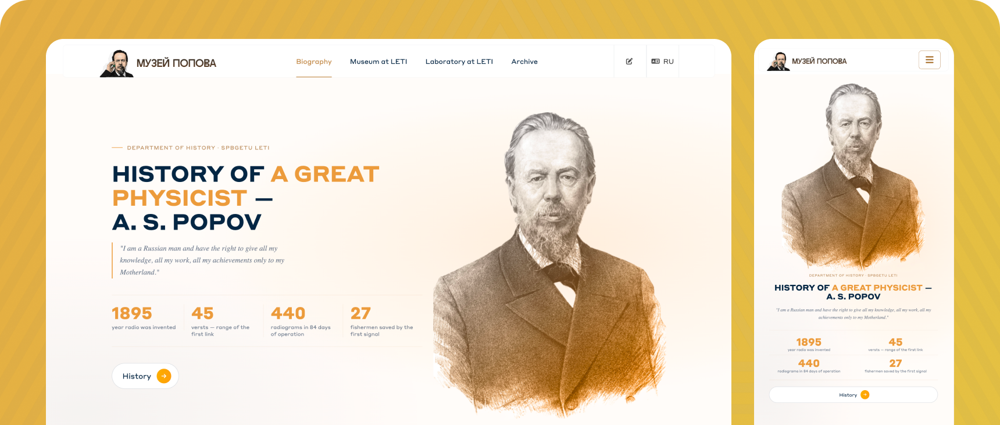

# Popov Museum — Website

A bilingual website for the Museum of Alexander Stepanovich Popov, the inventor of radio, located at St. Petersburg Electrotechnical University (ETU LETI).

Built as part of a joint project between the Student Career Office (SOKT) and the Department of History, Culture, State and Law at ETU LETI.

## Team

Developed by the IT department of the Student Career Office (SOKT) at ETU LETI.

| Name | Role |
|------|------|
| **Matvey Melikhov** — IT Department Lead | Team Lead, Fullstack |
| Sergey | Frontend |
| Dima | Frontend |
| Lenya | Backend |
| Vanya | Backend |

## Stack

- **Backend:** Python 3, Flask 2.3
- **Templating:** Jinja2
- **Internationalization:** Flask-Babel (Russian / English)
- **Styles:** SCSS → CSS, BEM methodology
- **Icons:** Font Awesome

## Features

- Bilingual interface (RU / EN) with language switcher
- Biography of A.S. Popov with rich text sections and inline images
- Pages for the Apartment Museum and Laboratory Museum at LETI
- Document archive
- Excursion registration form
- Responsive design — mobile, tablet, desktop
- Frosted-glass fixed header

## Project Structure

```
app/
├── templates/         # Jinja2 templates
│   ├── base-templates/
│   ├── index.html     # Biography / main page
│   ├── apartment.html
│   ├── laboratory.html
│   ├── archive.html
│   └── registration.html
├── static/
│   ├── css/           # Compiled CSS + SCSS source
│   ├── js/
│   └── img/
├── translations/      # .po / .mo locale files
└── routes.py
```

## Getting Started

```bash
python -m venv .venv
source .venv/bin/activate
pip install -r requirements.txt
python main.py
```

The app runs at `http://localhost:5000` with debug mode enabled.

To recompile styles after editing SCSS:

```bash
npx sass app/static/css/main.scss app/static/css/main.css --no-source-map
npx sass app/static/css/index-style.scss app/static/css/index-style.css --no-source-map
```
